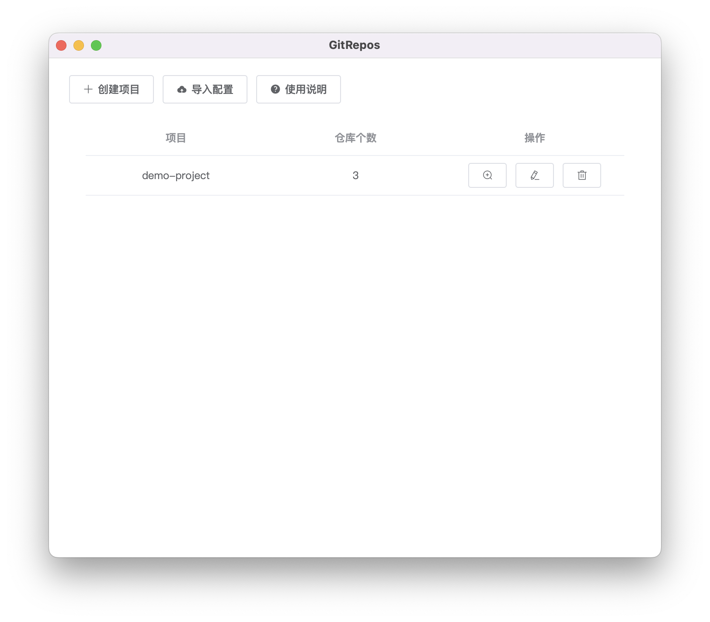
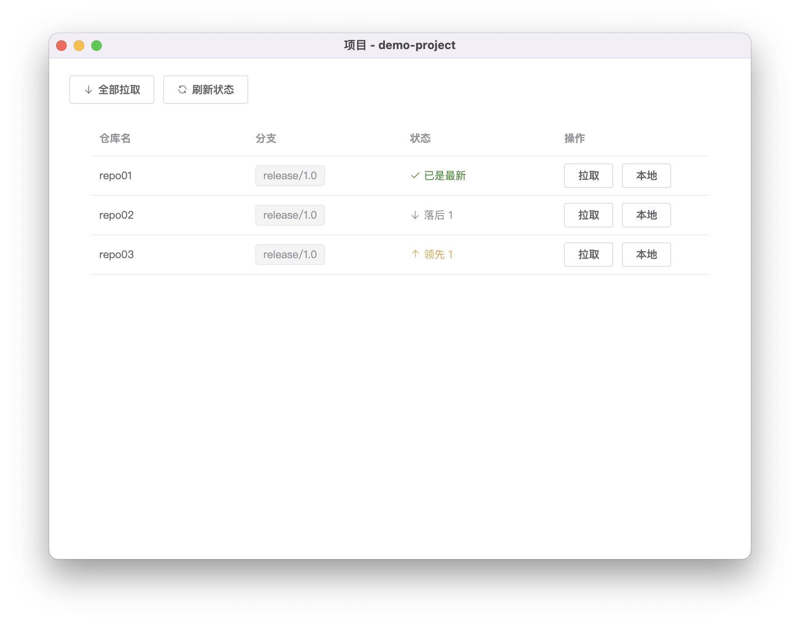

# GitRepos

GitRepos 是一个多Git仓库项目管理工具，基于 [Electron](https://www.electronjs.org/)、[Vue2](https://v2.vuejs.org/)、[Element UI](https://element.eleme.cn/)、[Simple Git](https://github.com/steveukx/git-js)。

当一个项目由多个仓库组成时，日常开发频繁使用`git status`、`git pull`就变得重复且枯燥。

> 这个工具不是用于`diff`、`commit`、`push`，对于单个仓库的操作，推荐使用 [Sourcetree](https://www.sourcetreeapp.com/)。

## 使用方法

点击创建项目，可以选择多个本地仓库。



打开某个项目，窗口显示项目中每个仓库的分支、状态信息，可以批量拉取同步远程仓库。



## 开发环境配置

### 安装依赖
```
npm install
```

### 本地启动
```
npm run electron:serve
```

### 构建打包
```
npm run electron:build
```
